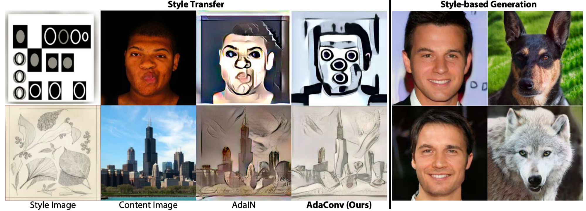
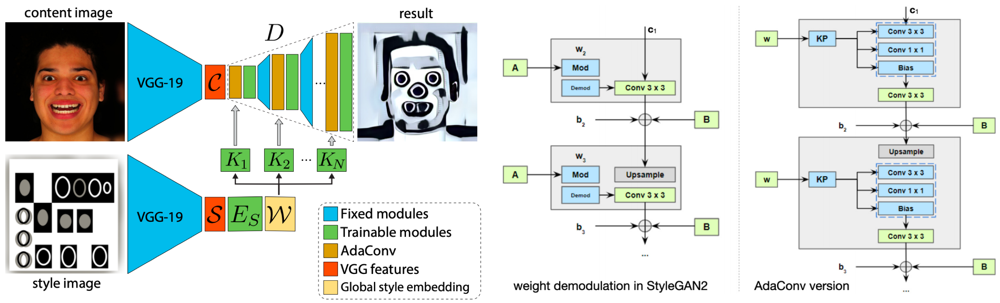

## AdaConv &mdash; Simple TensorFlow Implementation [[Paper]](https://openaccess.thecvf.com/content/CVPR2021/papers/Chandran_Adaptive_Convolutions_for_Structure-Aware_Style_Transfer_CVPR_2021_paper.pdf)
### : Adaptive Convolutions for Structure-Aware Style Transfer (CVPR 2021)

## Note
This repository does not implement all codes, but only implements the core modules of the paper.

<div align="center">
  
  
</div>

## Requirements
 * Tensorflow == 2.5.0

## Usage
```python
feats = tf.random.normal(shape=[5, 64, 64, 256])
style_w = tf.random.normal(shape=[5, 512])

kp = KernelPredict(in_channels=feats.shape[-1], group_div=1)
adac = AdaConv(channels=1024, group_div=1)

w_spatial, w_pointwise, bias = kp(style_w)
x = adac([feats, w_spatial, w_pointwise, bias]) # [5, 64, 64, 1024]
```

## Author
[Junho Kim](http://bit.ly/jhkim_ai)
